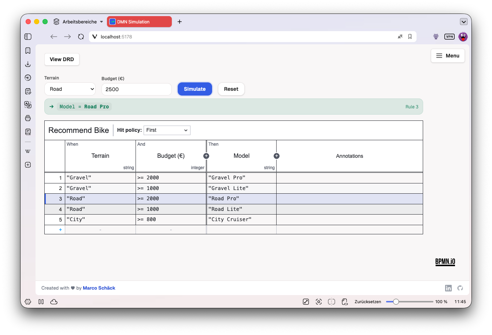

# dmn-js-simulation

[](https://www.npmjs.com/package/@emaarco/dmn-js-simulation)
[](https://github.com/emaarco/dmn-js-simulation/blob/main/LICENSE)
[](https://emaarco.github.io/dmn-js-simulation/)

> Simulate DMN decision tables directly in a [dmn-js](https://github.com/bpmn-io/dmn-js) modeler — feed in concrete inputs and instantly see which rules match, which don't, and what the decision returns.



## The idea behind this project

`@emaarco/dmn-js-simulation` is to DMN what [`bpmn-js-token-simulation`](https://github.com/bpmn-io/bpmn-js-token-simulation) is to BPMN: it lets you validate decision logic **while you model it**, instead of discovering mistakes later in process code, tests, or production. It supports **all DMN hit policies** (`UNIQUE`, `FIRST`, `ANY`, `PRIORITY`, `COLLECT` with `SUM`/`MIN`/`MAX`/`COUNT`, `RULE ORDER`, `OUTPUT ORDER`) and **multi-decision DRD chaining**.

## Features

- **Decision-table simulation** — an input form appears above the table; run it to highlight the matched rule(s) and read off the result. Rules dropped by the hit policy (e.g. under `FIRST`/`PRIORITY`) are shown as dimmed _candidates_, so the policy's effect is visible.
- **All hit policies**, including `COLLECT` aggregations and policy-violation warnings (e.g. `UNIQUE` matched twice).
- **DRD chaining** — simulate a whole decision requirement graph: set the input-data leaves once, and every decision is evaluated in dependency order. Fired decisions are highlighted and annotated with their result; drilling into a decision reflects that run's row highlights.
- **Drop-in** — installs like any dmn-js module via `additionalModules`; `dmn-js` is a peer dependency, so it drives the modeler you already use.
- **Themeable** — all UI is class-namespaced and driven by CSS variables you can override.

## Installation

```bash
npm install @emaarco/dmn-js-simulation
```

`dmn-js` (>= 17) is a peer dependency — install it if you haven't already.

## Usage

```ts
import DmnModeler from 'dmn-js/lib/Modeler'
import DmnSimulationModule from '@emaarco/dmn-js-simulation'
import '@emaarco/dmn-js-simulation/assets/dmn-js-simulation.css'

const modeler = new DmnModeler({
  container: '#canvas',
  decisionTable: { additionalModules: [DmnSimulationModule.decisionTable] },
  drd: { additionalModules: [DmnSimulationModule.decisionRequirementsDiagram] },
})

await modeler.importXML(dmnXml)
```

Register only the view(s) you need. The modules are also exported individually:

```ts
import { DmnSimulationTableModule, DmnSimulationDecisionRequirementsDiagramModule } from '@emaarco/dmn-js-simulation'
```

> **DRD view:** make sure your app imports dmn-js's icon font
> (`dmn-js/dist/assets/dmn-font/css/dmn-embedded.css`) alongside its other
> stylesheets — otherwise the DRD editor palette icons render blank.

### Evaluate without a modeler

The framework-free evaluation core is exported too, for tests or headless use:

```ts
import { parseDecisionModelFromXml, evaluateDecision } from '@emaarco/dmn-js-simulation'

const model = parseDecisionModelFromXml(dmnXml)
const result = evaluateDecision(model, ['Fall', 8])
// → { matchedRuleIndices, reportedRuleIndices, outputs, aggregation?, violation? }
```

`evaluateDecisionRequirementsDiagram` + `definitionsToDecisionRequirementsDiagramModel` do the same for a whole DRD graph.

## Contributing

Contributions are welcome — see [CONTRIBUTING.md](CONTRIBUTING.md) for the
monorepo layout, scripts, and how to build, test and run the example locally.

## Credits

- [dmn-js](https://github.com/bpmn-io/dmn-js) by [bpmn.io](https://bpmn.io/) — the DMN modeler this add-on plugs into.
- Inspired by [bpmn-js-token-simulation](https://github.com/bpmn-io/bpmn-js-token-simulation), the BPMN token simulator by [bpmn.io](https://bpmn.io/).

## License

[MIT](LICENSE) © Marco Schäck
